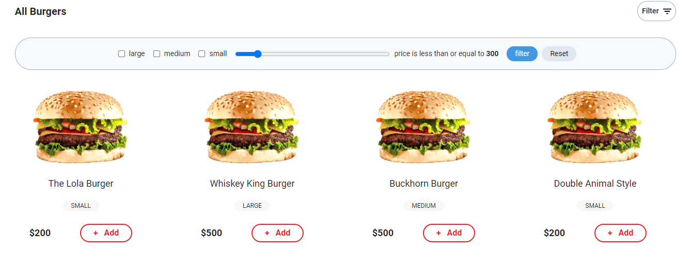
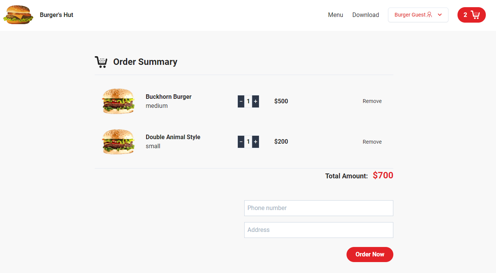
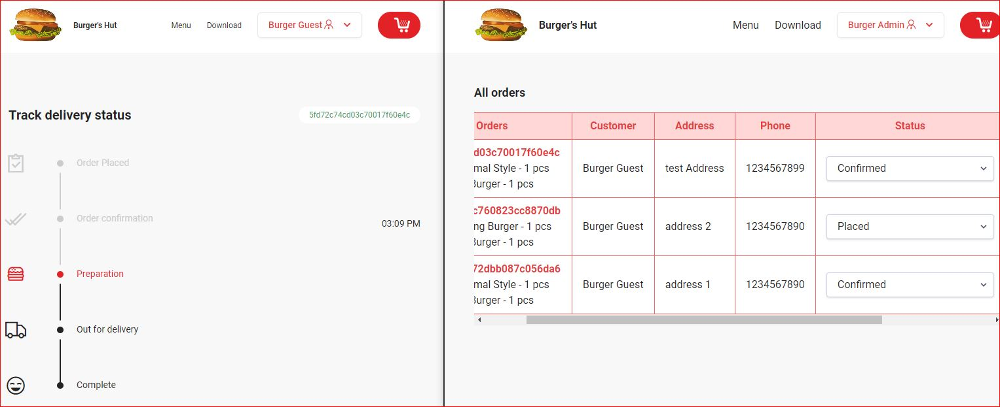

# Burgers' Hut :hamburger:

> Burgers' Hut is a Cash On Delivery E-commerce Application with Realtime Order Tracking Functionalities.
> <br> <b>Node | Express | MongoDB | WebSocket | ejs | Tailwind css</b>

## Demo

The App is live at [Burger's Hut](https://burgershut.herokuapp.com/)

## Screen Shots





## Login Credentials

<b> Guest Role </b>

<ul>
    <li>Login username: <b>Guest</b></li>
    <li>Login password: <b>Guest123</b></li>
</ul>
<hr>
<b> Admin Role </b>
<ul>
    <li>Login username: <b>Admin</b></li>
    <li>Login password: <b>Admin123</b></li>
</ul>

## Install Dependencies

```
npm install
```

## Run App

```
npm run dev
```

<b>Burgers' Hut Functions</b>

<ul>
    <li>Authentication:
        <ul>
            <li>Customer / Admin register</li>
            <li>Customer / Admin login</li>
        </ul>
    </li>
    <li>Authorization:
        <ul>
            <li>Customer cannot order new items without being authenticated</li>
            <li>Admin can not do order management without being authenticated</li>
        </ul>
    </li>
        <li>Cart Functionalities:
        <ul>
            <li>Burger item(s) can add to cart realtime</li>
            <li>Remove Burger item(s) from cart realtime</li>
            <li>Update Each item price, Total Quantity, Total Price realtime  when increasing or decreasing item qunatity</li>
            <li>Updating Total Quantity, Total Price realtime  when removing a selected item from cart</li>
        </ul>
        </li>
        <li>Realtime Order Tracking (Web Sockets):
        <ul>
            <li>Updating Admin Order list When a customer add an Order</li>
            <li>Customer Can see Item Status On From the Order Tracker</li>
            <li>Admin can Set Order status and it will notified to customer and and update cutomer order tracker simultaneously</li>
            <li>Customer can view order Item history</li>
        </ul>
        <li>Utilities :
        <ul>
            <li>Filter Functionalities</li>
            <li>Paginations</li>
        </ul>
        </li>
        <li>Security :
        <ul>
            <li>Encrypt passwords and reset tokens</li>
            <li>Prevent NoSQL injections</li>
            <li>Add headers for security (helmet)</li>
            <li>Prevent cross site scripting - XSS</li>
            <li>Add a rate limit for requests of 100 requests per 10 minutes</li>
            <li>Protect against http param polution</li>
            <li>Use cors</li>
        </ul>
        </li>
    <li>Responsive</li>
    <li>Lazy Loading</li>
</ul>
<ul>
    <li>Deployment
        <ul>
        <li><a href ="www.heroku.com">Heroku</a></li>
        </ul>
    </li>
</ul>

## Future Enhancements:rocket:

<ul>
    <li>Payment Gateway Integration</li>
    <li>Admin, Cutomer functionalities</li>
</ul>

<p>Give a :star: if you find this repo is helpful. Pull request are welcome:100:<p>
